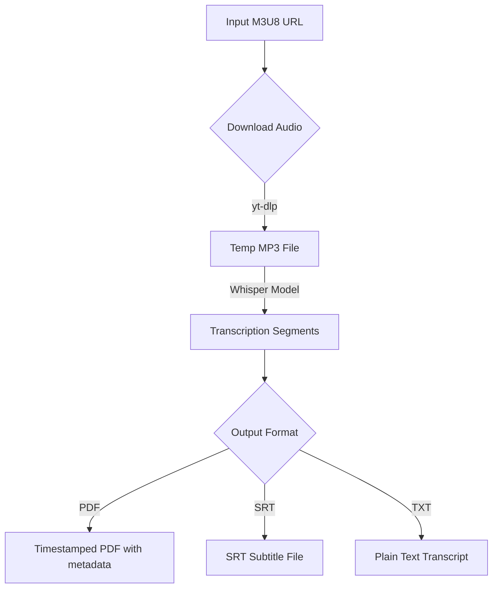

# M3U8 Transcript Generator


A powerful Python tool that downloads audio from m3u8 streams (including complex Mediasite streams), transcribes it using [OpenAI Whisper](https://github.com/openai/whisper), and generates clean, timestamped transcripts in **PDF**, **SRT**, or **TXT** format. Features a modern GUI with progress tracking!

## Features

- **Robust Downloading** -- Uses `yt-dlp` to handle complex HLS streams and authentication tokens.
- **Accurate Transcription** -- Powered by OpenAI's Whisper models (runs locally, no API keys needed).
- **Multiple Output Formats** -- PDF (with metadata), SRT subtitles, or plain text.
- **Language Selection** -- Auto-detect or specify a language for better accuracy.
- **Modern GUI** -- CustomTkinter interface with progress bar and cancel support.
- **Automatic Organization** -- Saves transcripts to a `transcripts/` folder with timestamps.
- **Model Caching** -- Whisper models are cached in memory for faster repeated use.

## Interface


## Workflow



## Prerequisites

- Python 3.9+
- [FFmpeg](https://ffmpeg.org/download.html) installed and on your system PATH.

## Installation

1. **Clone the repository:**
   ```bash
   git clone https://github.com/guirguispierre/m3u8-transcript.git
   cd m3u8-transcript
   ```

2. **Install dependencies:**
   ```bash
   pip install -r requirements.txt
   ```

   Or install as a package:
   ```bash
   pip install -e .
   ```

## Usage

### Graphical Interface (Recommended)
Launch the GUI to easily paste URLs and configure options:
```bash
python3 main.py --gui
```
*Or simply run `python3 main.py` without arguments.*

### Command Line Interface

**Basic Run (PDF output):**
```bash
python3 main.py "YOUR_M3U8_URL"
```

**Generate SRT subtitles:**
```bash
python3 main.py "URL" -f srt
```

**Generate plain text:**
```bash
python3 main.py "URL" -f txt -o lecture_notes.txt
```

**All Options:**

| Flag | Description |
|------|-------------|
| `-o`, `--output` | Custom output filename/path |
| `-f`, `--format` | Output format: `pdf`, `srt`, `txt` (default: `pdf`) |
| `-m`, `--model` | Whisper model: `tiny`, `base`, `small`, `medium`, `large` (default: `base`) |
| `-l`, `--language` | ISO-639-1 language code (e.g. `en`, `fr`). Auto-detects if omitted |
| `--keep-audio` | Keep the downloaded MP3 file |
| `-v`, `--verbose` | Enable verbose (DEBUG) logging |
| `--gui` | Launch the GUI interface |

**Examples:**
```bash
# Transcribe with the medium model in French
python3 main.py "URL" -m medium -l fr

# Keep the audio and use verbose logging
python3 main.py "URL" --keep-audio -v

# Custom output with SRT format
python3 main.py "URL" -f srt -o lecture.srt
```

## Running Tests

```bash
pytest -v
```

## Credits

Made by Pierre Guirguis with love.
