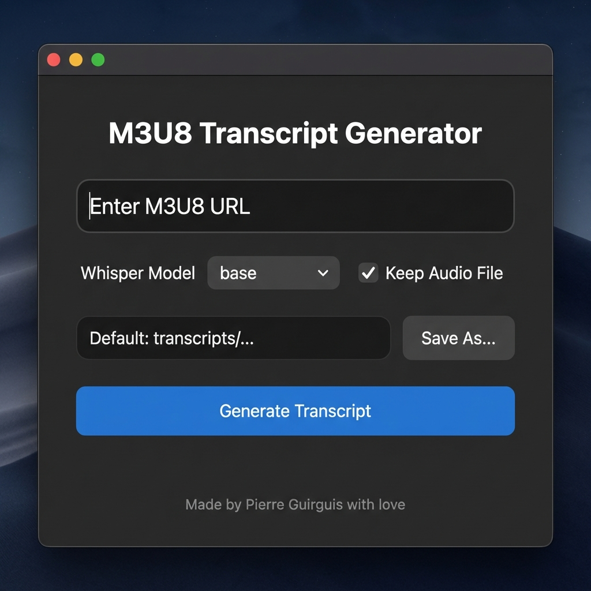
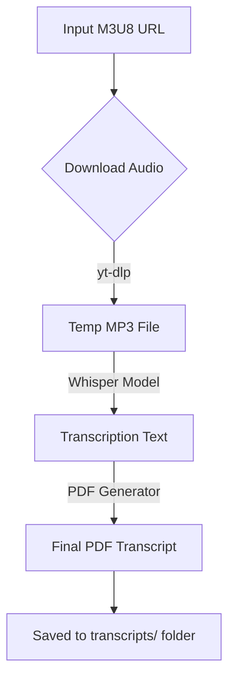

# M3U8 Transcript Generator


A powerful Python tool that downloads audio from m3u8 streams (including complex Mediasite streams), transcribes it using [OpenAI Whisper](https://github.com/openai/whisper), and generates clean, timestamped PDF transcripts. Now features a modern GUI!

## 🚀 Features

- **Robust Downloading**: Uses `yt-dlp` to handle complex HLS streams and authentication tokens.
- **Accurate Transcription**: Powered by OpenAI's Whisper models (runs locally, no API keys needed).
- **PDF Output**: Generates professionally formatted PDFs with timestamps.
- **Modern GUI**: A user-friendly graphical interface built with CustomTkinter.
- **Automatic Organization**: Saves transcripts to a `transcripts/` folder with organized timestamps.

## 📸 Interface



## 🔄 Workflow



## 🛠 Prerequisites

- Python 3.9+
- [FFmpeg](https://ffmpeg.org/download.html) installed and on your system PATH.

## 📦 Installation

1. **Clone the repository:**
   ```bash
   git clone https://github.com/guirguispierre/m3u8-transcript.git
   cd m3u8-transcript
   ```

2. **Install dependencies:**
   ```bash
   pip install -r requirements.txt
   ```

## 💻 Usage

### Graphical Interface (Recommended)
Launch the GUI to easily paste URLs and configure options:
```bash
python3 main.py --gui
```
*Or simply run `python3 main.py` without arguments.*

### Command Line Interface

**Basic Run:**
```bash
python3 main.py "YOUR_M3U8_URL"
```

**Options:**
- `-o`, `--output`: Specify custom output filename/path.
  ```bash
  python3 main.py "URL" -o my_lecture.pdf
  ```
- `-m`, `--model`: Specify Whisper model (`tiny`, `base`, `small`, `medium`, `large`). Default: `base`.
  ```bash
  python3 main.py "URL" -m medium
  ```
- `--keep-audio`: Keep the downloaded MP3 file.
  ```bash
  python3 main.py "URL" --keep-audio
  ```

## ❤️ Credits

Made by Pierre Guirguis with love.
