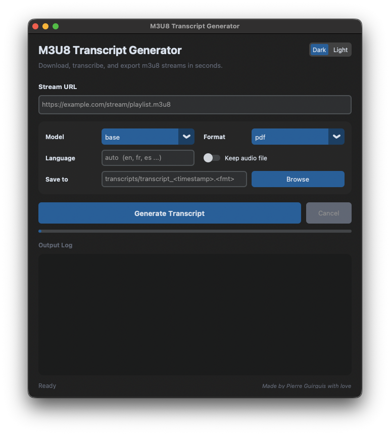
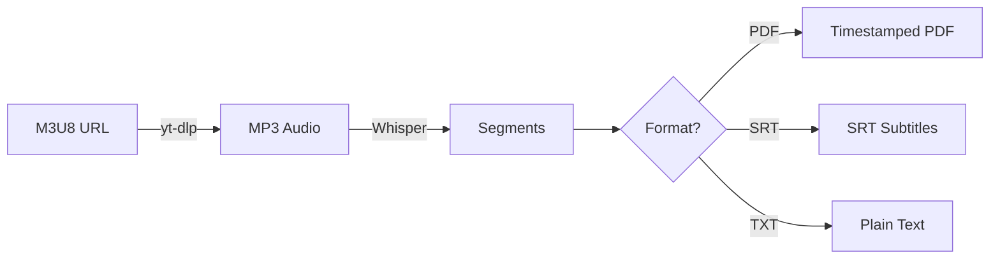

<p align="center">
  
</p>

<p align="center">
  <strong>Download audio from m3u8 streams, transcribe with Whisper, and export to PDF, SRT, or TXT.</strong>
</p>

<p align="center">
  
  
  
  
  
</p>

---

## Features

| | Feature | Description |
|---|---------|-------------|
| **1** | **Robust Downloading** | Uses `yt-dlp` to handle complex HLS streams and authentication tokens |
| **2** | **Accurate Transcription** | Powered by OpenAI's Whisper models -- runs locally, no API keys needed |
| **3** | **Multiple Output Formats** | Export as PDF (with metadata), SRT subtitles, or plain text |
| **4** | **Language Selection** | Auto-detect or specify a language for better accuracy |
| **5** | **Modern GUI** | CustomTkinter interface with progress bar, output log, and cancel support |
| **6** | **Dark / Light Theme** | System, Dark, and Light appearance modes |
| **7** | **Model Caching** | Whisper models are cached in memory for faster repeated use |
| **8** | **Auto Organization** | Saves transcripts to `transcripts/` with timestamps |

---

## Interface

<p align="center">
  
</p>

<p align="center"><em>Dark mode with output log, progress bar, format selector, and theme toggle.</em></p>

---

## Workflow



---

## Prerequisites

- **Python 3.9+**
- **[FFmpeg](https://ffmpeg.org/download.html)** installed and on your system PATH

---

## Installation

**Clone and install:**

```bash
git clone https://github.com/guirguispierre/m3u8-transcript.git
cd m3u8-transcript
pip install -r requirements.txt
```

Or install as an editable package:

```bash
pip install -e .
```

---

## Usage

### GUI (Recommended)

```bash
python3 main.py
```

Or explicitly:

```bash
python3 main.py --gui
```

### CLI

**Basic (PDF output):**
```bash
python3 main.py "YOUR_M3U8_URL"
```

**SRT subtitles:**
```bash
python3 main.py "URL" -f srt
```

**Plain text with custom name:**
```bash
python3 main.py "URL" -f txt -o lecture_notes.txt
```

**Medium model, French, keep audio:**
```bash
python3 main.py "URL" -m medium -l fr --keep-audio
```

### All Options

| Flag | Description | Default |
|------|-------------|---------|
| `-f`, `--format` | Output format: `pdf`, `srt`, `txt` | `pdf` |
| `-m`, `--model` | Whisper model: `tiny`, `base`, `small`, `medium`, `large` | `base` |
| `-l`, `--language` | ISO-639-1 language code (e.g. `en`, `fr`) | auto-detect |
| `-o`, `--output` | Custom output filename/path | auto-generated |
| `--keep-audio` | Keep the downloaded MP3 file | off |
| `-v`, `--verbose` | Enable DEBUG-level logging | off |
| `--gui` | Launch the GUI interface | -- |

---

## Project Structure

```
m3u8Transcript/
├── main.py            # CLI entry point and argument parsing
├── gui.py             # CustomTkinter GUI application
├── workflow.py        # Shared download -> transcribe -> write pipeline
├── transcriber.py     # yt-dlp download + Whisper transcription
├── writers.py         # PDF, SRT, and TXT output writers
├── pdf_writer.py      # Backward-compatible PDF shim
├── logger.py          # Centralized logging configuration
├── test_pdf_gen.py    # Test suite (pytest)
├── pyproject.toml     # Package metadata and build config
├── requirements.txt   # Pinned dependencies
├── assets/
│   ├── header.png     # README banner
│   └── gui_dark.png   # GUI screenshot
└── transcripts/       # Default output directory (auto-created)
```

---

## Running Tests

```bash
pytest -v
```

---

## Credits

Made by Pierre Guirguis with love.
